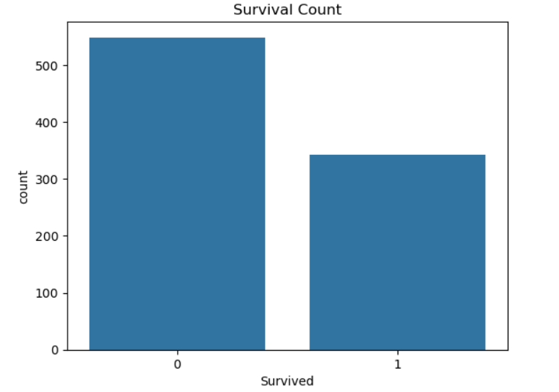
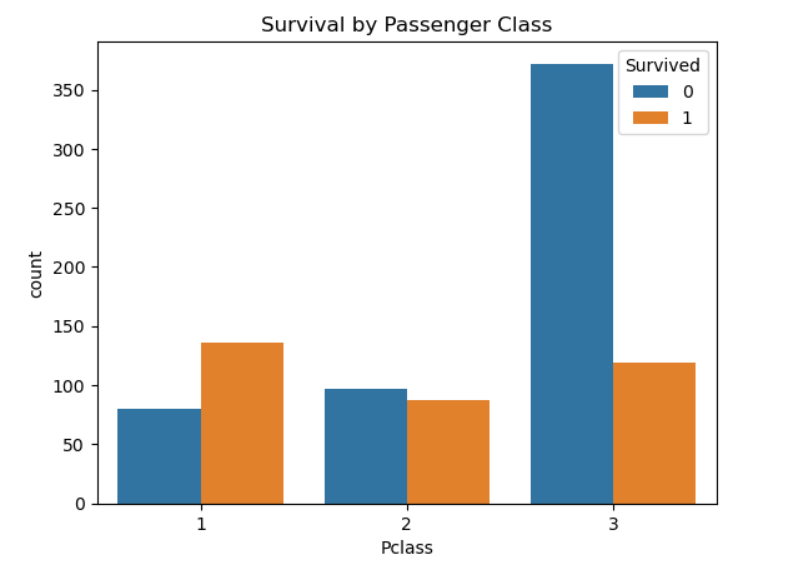
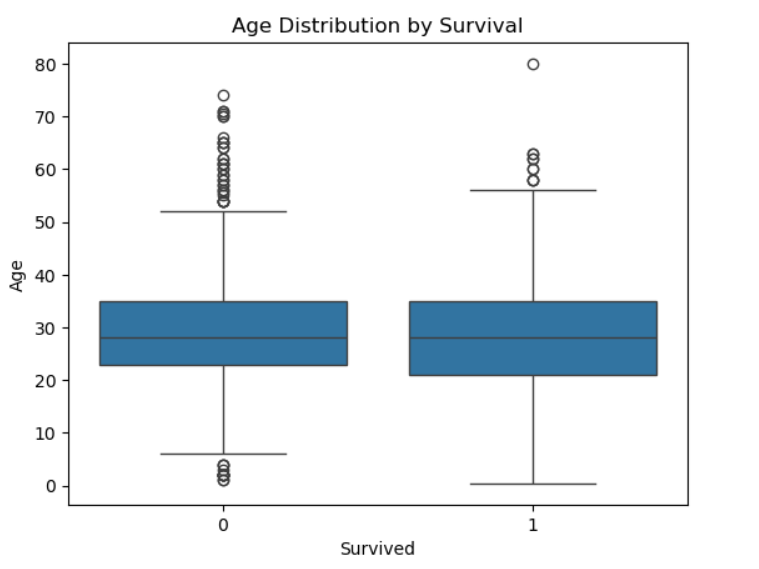
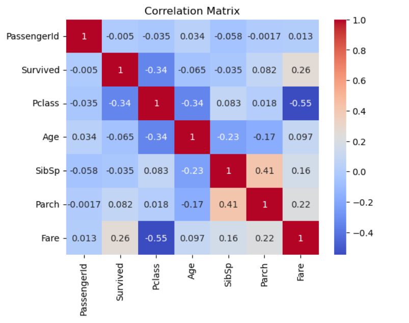

#Titanic - Exploratory Data Analysis (EDA)
##  Overview
This project performs Exploratory Data Analysis (EDA) on the Titanic dataset. It explores survival patterns across different passenger features like age, class, and gender.

##Visualizations

### 1. Survival Count

### 2. Survival by Passenger Class

### 3. Age Distribution by Survival

### 4. Correlation Matrix

## Objectives
- Clean missing data
- Analyze feature relationships
- Visualize survival trends
- Gain business insights

##Tools & Libraries
- Python
- Pandas
- Matplotlib
- Seaborn
- Jupyter Notebook

##Key Insights
- Females had higher survival rates.
- 1st Class passengers were more likely to survive.
- Children had better survival odds than older passengers.

##Files
- `titanic_eda.ipynb`: Jupyter Notebook with full EDA
- `README.md`: Project documentation
